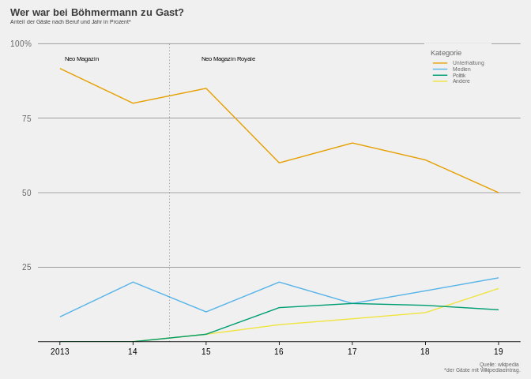
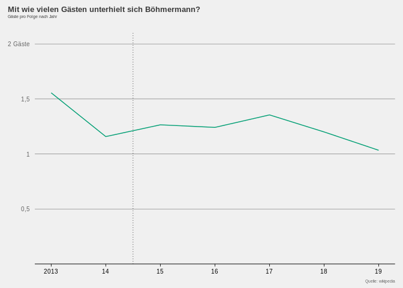
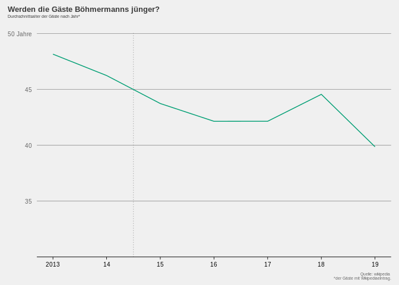
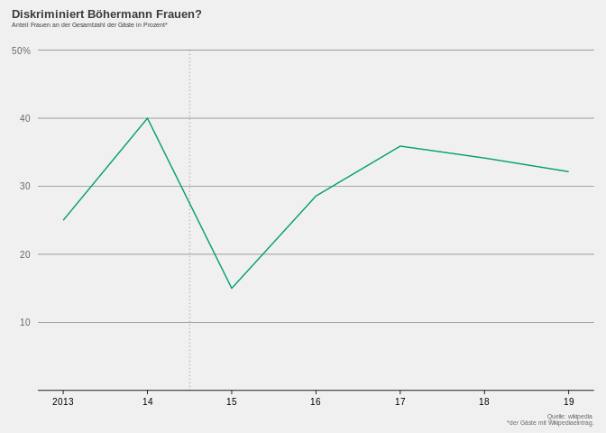
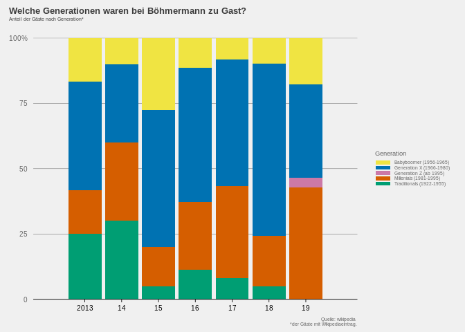

Guests of Neo Magazin (Royale)
================

## Packages

``` r
library(grid)
library(ggplot2)
library(tidyr)
```

## Theme

``` r
hp_theme <- function(base_size = 13, base_family = "") {
  theme_grey(base_size = base_size, base_family = base_family) %+replace%
    theme(
      
      # Base elements which are not used directly but inherited by others
      line =              element_line(colour = '#DADADA', size = 0.75,
                                       linetype = 1, lineend = "butt"),
      rect =              element_rect(fill = "#F0F0F0", colour = "#F0F0F0",
                                       size = 0.5, linetype = 1),
      text =              element_text(family = base_family, face = "plain",
                                       colour = "#656565", size = base_size,
                                       hjust = 0.5, vjust = 0.5, angle = 0,
                                       lineheight = 0.9, margin = margin(), debug = FALSE),
      plot.margin =       margin(12,10,5,10),
      # Modified inheritance structure of text element
      plot.title =        element_text(size = rel(0.75), family = '' ,
                                       face = 'bold', hjust = 0,
                                       vjust = 2.5, colour = '#3B3B3B'),
      plot.subtitle =     element_text(size = rel(0.4), family = '' ,
                                       face = 'plain', hjust = 0,
                                       vjust = 2.5, colour = '#3B3B3B', margin = margin(0,0,15,0)),
      axis.title.x =      element_blank(),
      axis.title.y =      element_blank(),
      axis.text =         element_text(),
      # Modified inheritance structure of line element
      axis.ticks =        element_line(),
      panel.grid.major =  element_line(),
      panel.grid.minor =  element_blank(),
      
      # Modified inheritance structure of rect element
      plot.background =   element_rect(),
      panel.background =  element_rect(),
      legend.key =        element_rect(colour = '#DADADA'),
      
      # Modifiying legend.position
      legend.position = 'none',
      
      complete = TRUE
    )
}
```

## Read in data

I do not include the data on the individual guests for privacy reasons.
However, the data can somewhat easily be verified using the original
source
(<https://de.wikipedia.org/wiki/Neo_Magazin_Royale/Episodenliste>) and
the corresponding Wikipedia entries of the individual guests. If you’re
curious how I obtained the data, hit me up.

``` r
data <- read.csv("./data.csv")
```

# Graphs

### 1\. occupations of guests per year

``` r
data %>%
  subset(select =c("year", "others", "politics", "media", "entertainment")) %>%
  gather(category ,percent, others:entertainment) %>%
  ggplot(aes(x=year, y=percent,group=category, colour=category)) + geom_line() +
  annotate("text", label = "Neo Magazin Royale", x = 2015.3, y = 95, size = 2, colour = "black") +
  annotate("text", label = "Neo Magazin", x = 2013.3, y = 95, size = 2, colour = "black") +
  scale_y_continuous(limits = c(0, 100.1), breaks = c(seq(25,100,25)) , expand = c(0, 0),  labels=c("25"="25","50"="50","75"="75","100" =       "100%")) +
  scale_x_continuous(breaks = seq(2013, 2019, by = 2), limits=c(2013,2019)) +
  geom_vline(xintercept=c(2014.5), linetype="dotted", size= 0.25, color="#656565") +
  scale_color_manual(breaks=c("entertainment","media","politics","others"), values=c("#E69F00", "#56B4E9", "#009E73", "#F0E442")  ,labels = c("Unterhaltung", "Medien", "Politik","Andere"), name = "Kategorie") + 
  labs(title = "Wer war bei Böhmermann zu Gast?", subtitle="Anteil der Gäste nach Beruf und Jahr in Prozent*", caption = "Quelle: wikipedia \n *der Gäste mit Wikipediaeintrag.") +
  hp_theme() + theme(axis.text= element_text(size=7.5), axis.title.x = element_blank(), plot.title.position = "plot", axis.title.y = element_blank(), panel.grid.major.x = element_blank(), panel.grid.major.y = element_line(size=.2, color="#656565"), axis.line.x=element_line( size=.3, color="black"), legend.position = c(0.87, 0.92), legend.text=element_text(size=5),legend.title=element_text(size=7), legend.key.height= unit(0.4,"line"),legend.key = element_blank(), axis.ticks.y = element_blank(), axis.ticks.x =element_line( size=.3, color="black"), plot.caption=element_text(size=5), axis.text.x=element_text(color="black"))
```

<!-- -->

### 2\. guests per episode per year

``` r
ggplot(data, aes(x=year, y=guests_episode,group=1))  +   
  geom_line(aes(group=1), color="#009E73") +
  scale_y_continuous(limits = c(0, 2.1),breaks = c(seq(0,2,0.5)), expand = c(0, 0), labels=c("0.0" = "", "0.5"="0,5", "1.0"="1", "1.5"= "1,5", "2.0"="2 Gäste")) +
  scale_x_continuous(breaks = seq(2013, 2019, by = 2), limits=c(2013,2019)) +
  geom_vline(xintercept=c(2014.5), linetype="dotted", size= 0.25) +
  labs(title = "Mit wie vielen Gästen unterhielt sich Böhmermann?", subtitle="Gäste pro Folge nach Jahr", caption = "Quelle: wikipedia") +
  hp_theme() + theme(axis.text= element_text(size=7.5), axis.title.x = element_blank(),plot.title.position = "plot",  axis.title.y = element_blank(), panel.grid.major.x = element_blank(), panel.grid.major.y = element_line(size=.2, color="#656565"), axis.line.x=element_line( size=.3, color="black"), legend.position = "right", legend.key = element_blank(), axis.ticks.y = element_blank(), axis.ticks.x =element_line( size=.3, color="black"), plot.caption=element_text(size=5), axis.text.x=element_text(color="black"))
```

<!-- -->

### 3\. mean age of guests per year

``` r
ggplot(data, aes(x=year, y=mean_age,group=1))+
  geom_line(aes(group=1), color="#009E73") +
  scale_y_continuous(limits = c(30, 50.1), breaks = c(seq(30,50,5)) , expand = c(0, 0), labels=c("30"="","35"="35","40"="40","45"="45","50"="50 Jahre")) +
  scale_x_continuous(breaks = seq(2013, 2019, by = 2), limits=c(2013,2019)) +
  geom_vline(xintercept=c(2014.5), linetype="dotted", size= 0.25, color="#656565") +
  labs(title = "Werden die Gäste Böhmermanns jünger?", subtitle="Durchschnittsalter der Gäste nach Jahr*", caption = "Quelle: wikipedia \n *der Gäste mit Wikipediaeintrag.") +
  hp_theme() + theme(axis.text= element_text(size=7.5), axis.title.x = element_blank(), plot.title.position = "plot", axis.title.y = element_blank(), panel.grid.major.x = element_blank(), panel.grid.major.y = element_line(size=.2, color="#656565"), axis.line.x=element_line( size=.3, color="black"), legend.position = "right", legend.key = element_blank(), axis.ticks.y = element_blank(), axis.ticks.x =element_line( size=.3, color="black"), plot.caption=element_text(size=5), axis.text.x=element_text(color="black"))
```

<!-- -->

### 4\. percentage of women of total guests per year

``` r
ggplot(data, aes(x=year, y=women,group=1)) + 
  geom_line(aes(group=1), color="#009E73") +
  scale_y_continuous(limits = c(0, 50.1), breaks = c(seq(10,50,10)) , expand = c(0, 0), labels=c("10"="10","20"="20","30"="30","40"="40","50"   = "50%")) +
  scale_x_continuous(breaks = seq(2013, 2019, by = 2), limits=c(2013,2019)) +
  geom_vline(xintercept=c(2014.5), linetype="dotted", size= 0.25, color="#656565") +
  labs(title = "Diskriminiert Böhermann Frauen?", subtitle="Anteil Frauen an der Gesamtzahl der Gäste in Prozent*", caption = "Quelle: wikipedia \n *der Gäste mit Wikipediaeintrag.") +
  hp_theme() + theme(axis.text= element_text(size=7.5), axis.title.x = element_blank(), plot.title.position = "plot", axis.title.y = element_blank(), panel.grid.major.x = element_blank(), panel.grid.major.y = element_line(size=.2, color="#656565"), axis.line.x=element_line( size=.3, color="black"), legend.position = "right", legend.key = element_blank(), axis.ticks.y = element_blank(), axis.ticks.x =element_line( size=.3, color="black"), plot.caption=element_text(size=5), axis.text.x=element_text(color="black"))
```

<!-- -->

### 5\. generations of guests per year (not included in the text)

``` r
data %>%
  subset(select =c("year", "traditionals","babyboomer","gen_x","millenials","gen_z")) %>%
  gather(generation ,percent, traditionals:gen_z) %>%
  ggplot(aes(fill=generation, y=percent, x=year)) + 
  geom_bar(position="fill", stat="identity")+
  scale_x_continuous(breaks = seq(2013, 2019, by = 2)) +
  scale_y_continuous(expand = c(0,0),breaks = c(seq(0,1,0.25)) , labels = c("0","25","50","75","100%")) +
  scale_fill_manual("Generation", values = c("traditionals"="#009E73","babyboomer"="#F0E442","gen_x"="#0072B2","millenials"="#D55E00","gen_z"="#CC79A7"),labels=c("traditionals"="Traditionals (1922-1955)","babyboomer"="Babyboomer (1956-1965)","gen_x"="Generation X (1966-1980)","millenials"="Millenials (1981-1995)","gen_z"="Generation Z (ab 1995)")) +
  labs(title = "Welche Generationen waren bei Böhmermann zu Gast?", subtitle="Anteil der Gäste nach Generation*", caption = "Quelle: wikipedia \n *der Gäste mit Wikipediaeintrag.") +
  hp_theme() + theme(axis.text= element_text(size=7.5), axis.title.x = element_blank(), plot.title.position = "plot", axis.title.y = element_blank(), panel.grid.major.x = element_blank(), panel.grid.major.y = element_line(size=.2, color="#656565"), axis.line.x=element_line( size=.3, color="black"), legend.position = "right", legend.text=element_text(size=5),legend.title=element_text(size=7), legend.key.height= unit(0.4,"line"),legend.key = element_blank(), axis.ticks.y = element_blank(), axis.ticks.x =element_line( size=.3, color="black"), plot.caption=element_text(size=5), axis.text.x=element_text(color="black"))
```

<!-- -->
